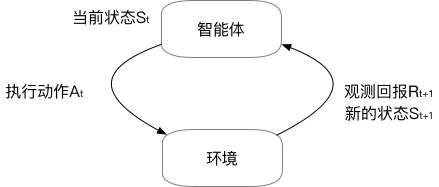
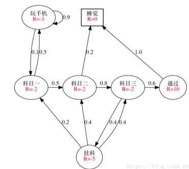
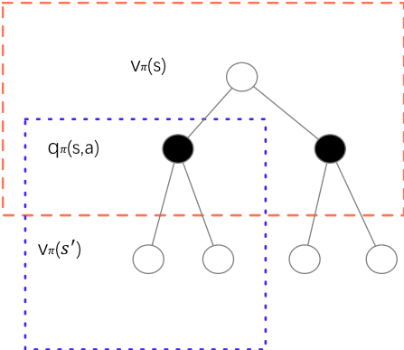

<center><h2>强化学习基础</h2></center>


### 基本框架



​	强化学习研究的是智能体（agent）与环境之间交互的任务，也就是让（agent）像人类一样通过试错，不断地学习在不同的环境下做出最优的动作，而不是有监督地直接告诉（agent）在什么环境下应该做出什么动作。既然与环境交互，必然会有反馈，也即回报。强化学习就是通过一系列的动作，获取一个最大的长期回报。


### 基本概念

1. 状态（S）：机器对环境的感知，所有可能的状态称为状态空间； 

2. 动作（A）：机器所采取的动作，所有能采取的动作构成动作空间；

3. 转移概率（P）：当执行某个动作后，当前状态会以某种概率转移到另一个状态； 

4. 奖励函数（R）：在状态转移的同时，环境给反馈给机器一个奖赏。

5. 策略（$\pi$）：当前状态下如何去选择某个动作

   

### 一个简单的例子

​	五子棋游戏：在一个n*n的表格里，两个人轮流下，直到有一个人的棋子满足一定条件，赢得比赛游戏结束，或者表格填满也没有人赢，则和棋。然后我们来看下对应的上面的概念。

 	1. 环境状态S：表格中每个格子都有三种转态。没棋子、自己的棋子、对手的棋子。因此，总共的状态是$3^{n*n}$种。
 	2. 动作A：由于只能下一步，所以所有没有棋子的位置，都是可选的动作，随着时间的进行，可选动作的的个数越来越小。
 	3. 奖励：奖励函数一般是我们自己设计。下棋的目的是赢棋，所以某个动作直接就棋面赢了，显然奖励最大，反之输了，则奖励最小。其他的动作也会设置一个奖励。
 	4. 策略：这个一般是学习得到的。训练的时候，我们会在每轮以较大的概率选择当前价值最高的动作，同时以较小的概率去探索新动作。

### 区别于监督学习

强化学习和监督学习的区别主要有以下两点：

 	1. 从上面的描述可以看出，强化学习是一个不断与环境交互的过程，通过环境的反馈，不断优化自己的过程。因此，强化学习是试错学习(Trail-and-error)，由于没有直接的指导信息，通过试错的方式来获得最佳策略。（可以认为是交互产生样本）
 	2. 强化学习不像监督学习一样有标签，而是环境反馈的回拨。由于当前状态会有影响后续状态。因此，具有延迟回报的性质。强化学习的指导信息很少，而且往往是在事后（最后一个状态）才给出的，这就导致了一个问题，就是获得正回报或者负回报以后，如何将回报分配给前面的状态。

### 回报

​	显然强化学习是一个离散的过程，当前的执行的动作的回报依赖于未来的回报（延迟回报），一个使得在任意时刻和状态下的长期回报都是最大的策略是我们最终需要得到的。因此最简单的就是累计回报

​		$$G_{t}=R_{t+1}+R_{t+2}+R_{t+3}+\ldots=\sum_{k=t+1}^{\infty} R_{k}​$$	
但实际上我们一般会用下面更通用的公式来代替：

​		$$G_{t}=R_{t+1}+\gamma R_{t+2}+\gamma^{2} R_{t+3}+\ldots+\gamma^{T-t-1} R_{T}=\sum_{k=0}^{T-t-1} \gamma^{k} R_{t+k+1}$$

​	$\gamma$称为折扣因子，$\gamma \in [0,1]$，当其为0是，只考虑当前回报。当其值为1是，当前回报和未来回报同等重要。当然我们需要保证累计回报收敛。因此， $\gamma$和$T​$ 需要满足一定的条件。

### 马尔科夫过程

​	马尔可夫链（Markov chain），又称离散时间马尔可夫链（discrete-time Markov chain），因俄国数学家安德烈·马尔可夫得名，为状态空间中经过从一个状态到另一个状态的转换的随机过程。

​		$$P(S_{t+1}|S_t)=P(S_{t+1}|S_1,S_2,...,S_t)$$

马尔科夫性的要点：

- 状态St包含了所有历史相关信息，或者说历史的所有状态的相关信息都在当前状态St上体现出来。因此，如果St知道了，那么S1,S2, ... ,St-1都可以被抛弃。
- 状态是将来的充分统计量。因此，这里要求环境时全观测。

马尔科夫过程：马尔科夫过程可以由一个二元组定义<S, P>，S表示了状态集合，P描述了状态转移矩阵。



```python
# condig: UTF-8
import numpy as np
def markov():
    init_array = np.array([0.1, 0.2, 0.7])
    transfer_matrix = np.array([[0.9, 0.075, 0.025],
                               [0.15, 0.8, 0.05],
                               [0.25, 0.25, 0.5]])
    restmp = init_array
    for i in range(25):
        res = np.dot(restmp, transfer_matrix)
        print i, "\t", res
        restmp = res
markov()
```

### 马尔可夫决策过程（MDP）

​	一个有限马尔可夫决策过程由一个四元组构成 M=(S,A,P,R, $\gamma$)。如上所述，S表示状态集空间，A表示动作集空间，P表示状态转移概率矩阵，R表示期望回报值，$\gamma$ 为折扣因子。与马尔科夫过程不同的是，**马尔科夫决策过程的状态转移是包含动作的**。

给定当前状态和动作，转移到另一个状态的概率计算：

​	$$	p\left(s^{\prime} | s, a\right)=\operatorname{Pr}\left\{S_{t+1}=s^{\prime} | S_{t}=s, A_{t}=a\right\} \in \mathbf{P}$$

在给定状态、动作和下一个状态的前提下，回报的计算：

​	$$r\left(s, a, s^{\prime}\right)=\mathbf{E}\left[R_{t+1} | S_{t}=s, A_{t}=a, S_{t+1}=s^{\prime}\right] \in \mathbf{R}$$

### 值函数及贝尔曼公式

​	强化学习的最终结果是找到一个环境到动作的映射—即策略$\pi(a|s)​$，在几乎所有的强化学习理论中都会定义值函数来表示给定策略下期望的未来回报，并将值函数作为评估学习效果的指标。目前常见的是将值函数直接定义为未来回报的期望：

​	$$v_{\pi}(s)=\mathbf{E}_{\pi}\left[G_{t} | S_{t}=s\right]=\mathbf{E}_{\pi}\left[\sum_{k=0}^{\infty} \gamma^{k} R_{t+k+1} | S_{t}=s\right]$$

上面表示的是在某个策略$\pi​$下，当环境处于状态s时未来回报的期望，因此又叫做状态值函数(state-value function for policy)，只跟当前状态有关。同样，我们也可以定义动作值函数(action-value function for policy)，如下：

​	$$q_{\pi}(s, a)=\mathbf{E}_{\pi}\left[G_{t} | S_{t}=s, A_{t}=a\right]=\mathbf{E}_{\pi}\left[\sum_{k=0}^{\infty} \gamma^{k} R_{t+k+1} | S_{t}=s, A_{t}=a\right]​$$

值函数和动作值函数的区别在于动作值是在给定动作下的期望回报，从形式上看，都可以写成递归的形式：

​	$$v_{\pi}(s)=\mathbf{E}_{\pi}\left[G_{t} | S_{t}=s\right]=\mathbf{E}_{\pi}\left[\sum_{k=0}^{\infty} \gamma^{k} R_{t+k+1} | S_{t}=s\right]$$

​		$$=\mathbf{E}_{\pi}\left[R_{t+1}+\gamma \sum_{k=0}^{\infty} \gamma^{k} R_{t+k+2} | S_{t}=s\right]​$$

​		$$=\sum_{a} \pi(a | s) \cdot \mathbf{E}_{\pi}\left[R_{t+1}+\gamma \sum_{k=0}^{\infty} \gamma^{k} R_{t+k+2} | S_{t}=s, A_{t}\right]$$

​		$$=\sum_{a} \pi(a | s) \sum_{s^{\prime}} p\left(s^{\prime} | s, a\right)\left[r\left(s, a, s^{\prime}\right)+\gamma \mathbf{E}_{\pi}\left[\sum_{k=0}^{\infty} \gamma^{k} R_{t+k+2} | S_{t+1}=s^{\prime}\right]\right]​$$

​		$$=\sum_{a} \pi(a | s) \sum_{s^{\prime}} p\left(s^{\prime} | s, a\right)\left[r\left(s, a, s^{\prime}\right)+\gamma v_{\pi}\left(s^{\prime}\right)\right]$$

因此当前状态下的回报可以用下一状态下的值函数求解，这个公式就是贝尔曼公式。

同理状态值函数也可以递归求解：

$$\begin{aligned} q_{\pi}(s, a) &=\mathbf{E}_{\pi}\left[G_{t} | S_{t}=s, A_{t}=a\right] \\ &=\mathbf{E}_{\pi}\left[R_{t+1}+\gamma \sum_{k=0}^{\infty} \gamma^{k} R_{t+k+2} | S_{t}=s, A_{t}=a\right] \\ &=\sum_{s^{\prime}} p\left(s^{\prime} | s, a\right)\left[r\left(s, a, s^{\prime}\right)+\gamma v_{\pi}\left(s^{\prime}\right)\right] \end{aligned}​$$

根据贝叶斯公式可以把两者关联：

​	$$v_{\pi}(s)=\sum_{a} \pi(a | s) q_{\pi}(s, a)$$



空心圆表示状态，实心圆表示动作-转态对。

### 最优值函数及贝尔曼最优公式

我们的目标就是使得任意时刻未来回报的期望值都是最大的，为此目标可以是：

​	$$\pi_{*}=\underset{\pi}{\arg \max } v_{\pi}(s)$$

策略可能有多个，但是最优的状态值函数和动作值函数是一致的：

​	$$v_{*}(s)=\max _{\pi} v_{\pi}(s)$$

​	$$q_{*}(s, a)=\max _{\pi} q_{\pi}(s, a)$$

目标函数有了，最重要的就是如何求解最优策略$\pi_*(a|s)$，由于状态之间的转移是依赖动作的，因此不需要求解状态的概率。

### 总结

​	本小节主要介绍了强化学习的基础知识，包括基本的定义，值函数和贝尔曼公式。但是并没有说如何求解最优策略。因此，下一节主要讲如何请求最优值。

