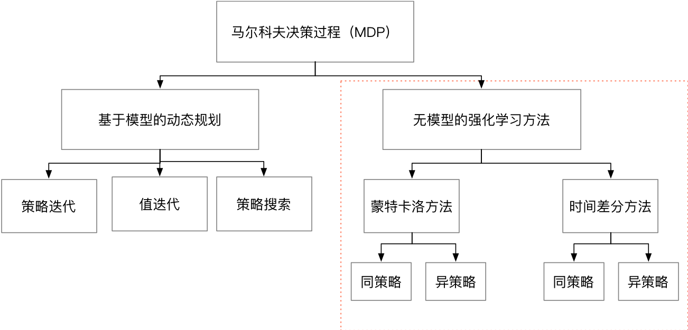
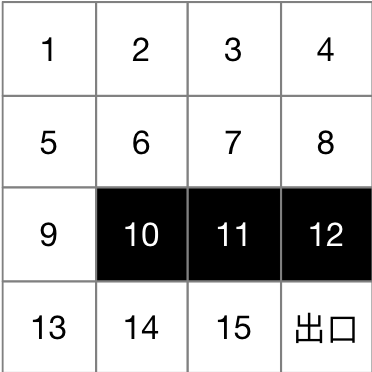

<center><h2>强化学习基础</h2></center>

###  常用随机策略

1、 贪婪策略

$$\begin{equation}
\pi_{*}(a|s)=\left\{
\begin{aligned}
1 &\quad if\quad a= arg maxq_{*}(s,a) \\
0 &\quad 其他
\end{aligned}
\right.
\end{equation}$$

​	贪婪策略是一个确定性的策略、只在动作值函数最大的动作以概率为1的几率选择，其他动作以概率0选择。

2、$\epsilon-greedy​$策略

$$\begin{equation}
\pi_{*}(a|s)=\left\{
\begin{aligned}
1-\epsilon+\frac{\epsilon}{A(s)} &\quad if\quad a= arg maxq_{*}(s,a) \\
\frac{\epsilon}{A(s)} &\quad 其他
\end{aligned}
\right.
\end{equation}$$

​	$\epsilon-greedy$策略是强化学习常用的随机策略。以比较大的概率选择动作值函数的最大的动作，以比较小的概率选择的其他动作，保证了探索性。

其他还有高斯策略、玻尔兹曼策略等。

​	从上面的策略来看，求解强化学习的根本需要求解或者估计状态值函数或动作值函数，因此下面主要是如何求解这两个函数。

### 强化学习分类



如果存在模型，可以使用动态规划的方法解决马尔科夫决策过程，类型于数学优化问题求解。强化学习的精髓是解决无模型的决策问题。我们按照前面的动作值函数计算和策略把强化学习分成两个步骤：1. 策略评估和2 策略改善。

​	所谓策略评估就是如何计算动作值函数，所谓策略改善就是如果等到一个更好的策略 $\pi(a|s)$。

​	所谓的同策略（on-policy）和异策略（off-policy）是指：

​		同策略：是指产生数据的策略与评估和改善的策略是同一个策略。

​		异策略：是指产生数据的策略与评估和改善的策略不是同一个策略。

### 蒙特卡罗方法

​	要评估当前策略$\pi$，我们可以使用策略$\pi$参数产生很多次试验，每次试验都是从初始状态到结束状态，我们称之为一次试验（episode）。因此，我们可以按照统计值函数的一个平均值来代替函数期望。

 1. 在没有模型的情况下，我们可以采用采样的方法计算状态值函数或者动作值函数。使用经验平均值替代期望。

 2. 蒙特卡罗策略改善

    1. 蒙特卡罗利用经验平均估计策略值函数。对每个状态使用最大化动作值函数来进行策略改善。即$\pi(s)= arg max \quad q_{*}(s,a)​$。

    3. 策略值函数递增计算方法

    $$\begin{aligned} v_k(s) = \frac{1}{k} \sum_{j=1}^kG_j(s) &=  \frac{1}{k} (\sum_{j=1}^{k-1}G_j(s) + G_k(s)) =v_{k-1}(s)+\frac{1}{k}(G_k(s)-v_{k-1}(s)) \end{aligned}$$

    我们可以看出上面公式是迭代更新的，参考机器学习的方式，我们可以设置一个学习率，因此公式如下：

    ​	$$\begin{aligned} v_k(s) =v_{k-1}(s)+\alpha(G_k(s)-v_{k-1}(s)) \end{aligned}$$

 3. 示例

     1. 假设我们有如下环境

        

        1. 我们有16个状态
        2. 4个可选动作（上下左右）

     2. 初始化

        ```python
        class GridExample:
            def __init__(self):
        
                self.states = range(1,17) #状态空间
                self.terminate_states = dict()  #终止状态为字典格式
                self.terminate_states[10] = 1
                self.terminate_states[11] = 1
                self.terminate_states[12] = 1
        		self.terminate_states[16] = 1
                self.actions = ["up", "down", "left", "right"]
                self.rewards = dict()        #回报的数据结构为字典
                self.rewards['6_down'] = -1.0
                self.rewards['7_down'] = -1.0
                self.rewards['8_down'] = -1.0
                self.rewards['14_up'] = -1.0
                self.rewards['15_up'] = -1.0
                self.rewards['16_up'] = -1.0
                self.rewards['9_right'] = -1.0
                self.rewards['15_right'] = 1.0
        
                self.transformer = dict();             #状态转移的数据格式为字典
                self.transformer["1_right"] = 2
                self.gamma = 0.8         #折扣因子
        ```

    3. 动作值函数计算

       ```python
           def qlearning(self, inter_num, epsilon, gamma):
               qfunc = dict()  # 动作值函数
               # 初始化动作值函数为0
               for s in self.states:
                   for a in self.actions:
                       key = "%d_%s" % (s, a)
                       qfunc[key] = 0.0
               count_s_a = dict()
               for i in range(inter_num):
                   s_sample = []
                   a_sample = []
                   r_sample = []
                   s = self.states[int(random.random()*len(self.states))]
                   is_terminate = False
                   count = 0
                   while not is_terminate and count < 400:
                       a = self.epsilon_greedy(qfunc, s, epsilon)
                       is_terminate, c_s, r = self.transfrom(s, a)
                       s_sample.append(s)
                       a_sample.append(a)
                       r_sample.append(r)
                       s = c_s
                       count += 1
                   # 更新动作值函数
                   g = 0.0
                   for j in range(len(s_sample), -1, -1):
                       g *= gamma
                       g += r_sample[i]
       
                   for j in range(len(s_sample)):
                       key = "%d_%s" % (s_sample[j], a_sample[j])
                       if key not in count_s_a:
                           count_s_a[key] = 0
                       count_s_a[key] += 1
                       qfunc[key] = (qfunc[key]*(count_s_a[key]-1) + g) /count_s_a[key]
                       g -= r_sample[i]
                       g /= gamma
               return qfunc
       ```

       4. 策略选择

          ```python
              def greedy(self, qfunc, state):
                  amax = 0
                  key = "%d_%s" % (state, self.actions[0])
                  qmax = qfunc[key]
                  for i in range(len(self.actions)):  # 扫描动作空间得到最大动作值函数
                      key = "%d_%s" % (state, self.actions[i])
                      q = qfunc[key]
                      if qmax < q:
                          qmax = q
                          amax = i
                  return self.actions[amax]
          
              def epsilon_greedy(self, qfunc, state, epsilon):
                  amax = 0
                  key = "%d_%s" % (state, self.actions[0])
                  qmax = qfunc[key]
                  for i in range(len(self.actions)):  # 扫描动作空间得到最大动作值函数
                      key = "%d_%s" % (state, self.actions[i])
                      q = qfunc[key]
                      if qmax < q:
                          qmax = q
                          amax = i
                  # 概率部分
                  pro = [0.0 for i in range(len(self.actions))]
                  pro[amax] += 1 - epsilon
                  for i in range(len(self.actions)):
                      pro[i] += epsilon / len(self.actions)
          
                  ##选择动作
                  r = random.random()
                  s = 0.0
                  for i in range(len(self.actions)):
                      s += pro[i]
                      if s >= r: return self.actions[i]
                  return self.actions[len(self.actions) - 1]
          ```

          

### 时间差分

 1. 公式推导

    $$\begin{aligned} v_k(s) = \frac{1}{k} \sum_{j=1}^kG_j(s) &=  \frac{1}{k} (\sum_{j=1}^{k-1}G_j(s) + G_k(s)) =v_{k-1}(s)+\frac{1}{k}(G_k(s)-v_{k-1}(s)) \end{aligned}​$$

    $$=v_{k-1}(s)+\frac{1}{k}(R_{k}(s) + \gamma G_{k}(s_{t+1})-v_{k-1}(s)) $$

    对于上面的是指，在**机器学习中非常常见的策略就是 ，我们可以使用估计值代替真实值**，也就是令：

    $$G_{k}(s_{t+1})  \approx v_{k}(s_{t+1})​$$

    因此，我们可以推导出，时间差分TD(0)的公式，如下：

    $$v_k(s) = v_{k-1}(s) + \frac{1}{k}(R_{k}(s) + \gamma v_{k}(s_{t+1})-v_{k-1}(s))$$

    $$\approx v_{k-1}(s) + \alpha (R_{k}(s) + \gamma v_{k}(s_{t+1})-v_{k-1}(s))$$

    其中将 $\delta_{t} = R_{t+1} + \gamma v(s_{t+1})-v(s_t)$  记做**时间差分误差(TD error)**

    时间差分包含同策略的Sarsa方法和异策略的Qlearning方法：

    Sarsa:

    $$q_{k}(s,a) = q_{k-1}(s,a) + \alpha (r_{k}(s) + \gamma q_{k}(s_{t+1}, a_{t+1})-q_{k-1}(s,a))$$

    Qlearning:

    $$q_{k}(s,a) = q_{k-1}(s,a) + \alpha (r_{k}(s) + \gamma \mathop{max}\limits_{a_{t+1}}  q_{k}(s_{t+1}, a_{t+1})-q_{k-1}(s,a))$$

    $$\mathop{a}\limits_{i=1}​$$

 2. 实例

     1. 还是上面的例子，我们更改下动作值函数更新的方式(Qlearning)，如下：

        ```python
            def qlearning_td(self, inter_num, epsilon, gamma, alpha):
                qfunc = dict()  # 动作值函数
                # 初始化动作值函数为0
                for s in self.states:
                    for a in self.actions:
                        key = "%d_%s" % (s, a)
                        qfunc[key] = 0.0
                for i in range(inter_num):
                    s = self.states[int(random.random() * len(self.states))]
                    is_terminate = False
                    count = 0
                    while not is_terminate and count < 400:
                        a = self.epsilon_greedy(qfunc, s, epsilon)
                        is_terminate, c_s, r = self.transfrom(s, a)
                        key = "%d_%s" % (s, a)
                        # 更新动作值函数
                        a_max = self.greedy(qfunc, c_s)
                        key1 = "%d_%s" % (c_s, a_max)
                        qfunc[key] = qfunc[key] + alpha*(r +
                                     gamma*qfunc[key1] - qfunc[key])
                        s = c_s
                        count += 1
                return qfunc
        ```

### MC和TD方法对比

1. 首选MC方法是无偏估计，但是每次 $G_t$的计算需要一次完整的 episode，中间会经过很多随机状态和动作，随机性会很大，因此方差会很大
2. 如果 $v_{k}(s_{t+1})$使用真实值，那么TD也是无偏的，然而该值也是估计值，因此，TD估计是有偏估计。与MC相比，TD只用到的了一步随机状态和动作，随机性会比MC小，相应的方差也小。

### 总结

本节主要介绍了有些常用的策略改善方法，列举了几类，没做详细的介绍，后面如果有需要会详细介绍。然后介绍了非常重要的两种计算状态值函数的方法-基于采样的方法和基于时间差分的方法，其中时间差分的方法是最重要的。下节，我们会介绍DQN的方法，深度学习与强化学习的结合。后面章节会详细介绍采样的方法：重要性采样、拒绝采样、mcmc采样。


[例子](https://github.com/wwbin2017/reinforcement-learning/blob/master/src/second-02.py)