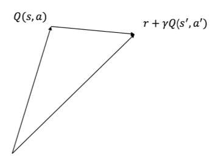
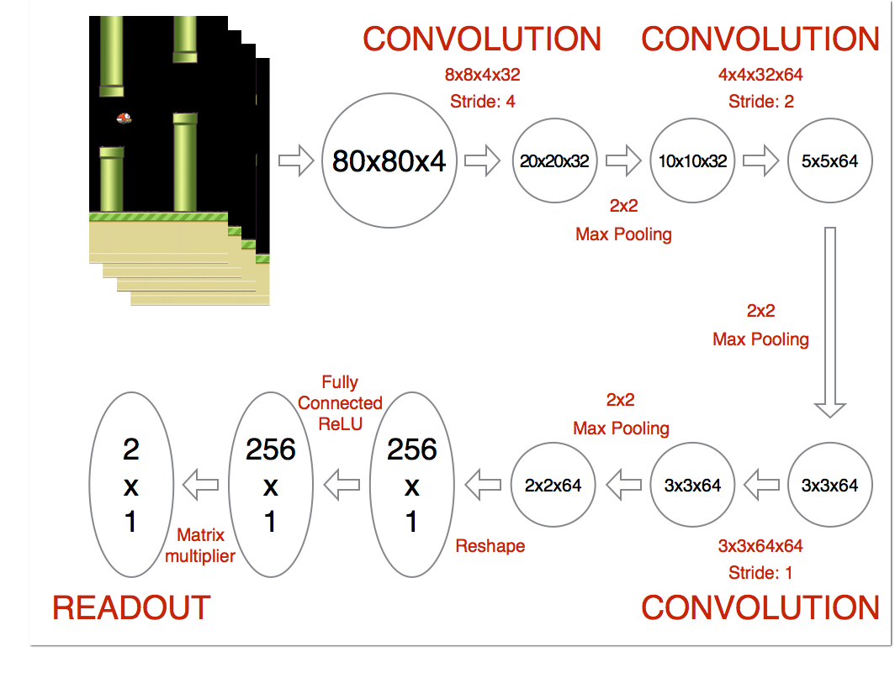
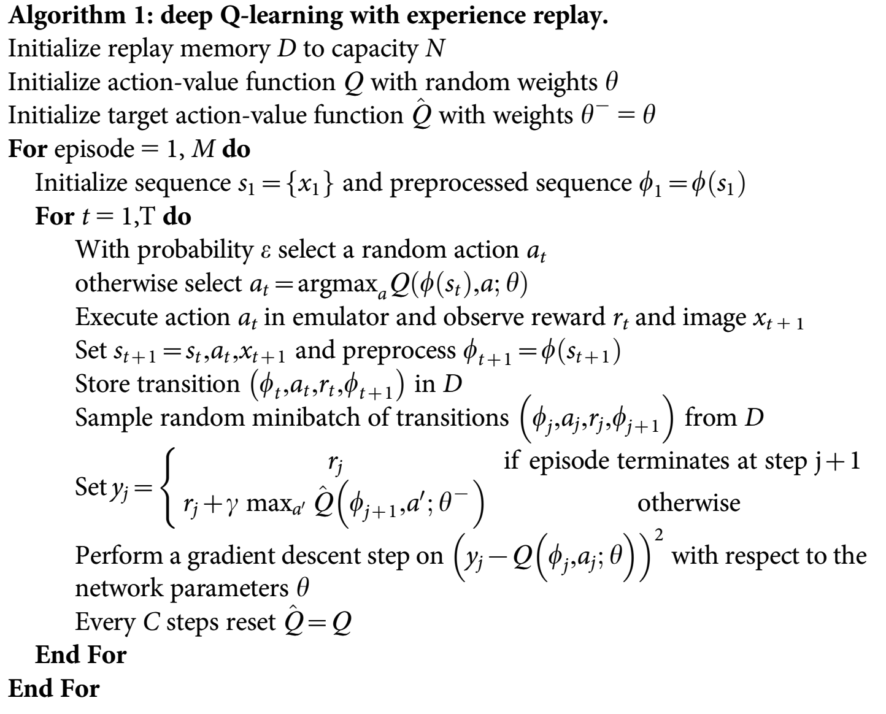

<h2>DQN</h2>

### 基于值函数逼近

​	前一张我们介绍了MC和TD方法，我们很容易看出这些方法需要状态空间和动作空间是离散的，而且还不能太大。其实是基于表格的强化学习，状态-动作对。

​	我们再回顾一下MC和TD的更新公式：

​	MC：

​                  $$\begin{aligned} q_k(s,a) =q_{k-1}(s,a)+\alpha(G_k(s,a)-q_{k-1}(s,a)) \end{aligned}$$

​	TD:

​          	$$ q_{k}(s,a) = q_{k-1}(s,a) + \alpha (R_{k}(s,a) + \gamma q_{k}(s_{t+1},a_{t+1})-q_{k-1}(s,a))$$   

​	从状态值函数的更新过程可以产出，值函数是不断的去逼近目标函数的。

​	函数逼近$\hat{v}(s,\theta)$的过程是一个监督学习的过程，其数据标签对$(S_t, U_t)$，这里的$U_t$可以对应上面公式的不同的值。因此我们可以设置训练目标函数为：

​					$$arg   min(q(s,a)-\hat{q}(s,a,\theta))^2$$

​	现在我们来看如何学习他，我们可以很容易的使用梯度下降的方法学习。

​				$$\theta_{t+1}=\theta_{t} + \alpha[U_t - \hat{v}(S_t, \theta_t)]\nabla\hat{v}(S_t, \theta_t)​$$

​	由前面介绍，产生一次试验的过程(MC)，其实是一个监督学习的过程，我们可以得到数据集$<s_1,G_1>, <s_2, G_2>, …, <s_t, G_t>$。

​	因此，

​				$$\nabla\theta = \alpha[G_t - \hat{v}(S_t, \theta)]\nabla_{\theta}\hat{v}(S_t, \theta_t)​$$

​	我们再看时间差分，TD(0)方法中的目标值函数为$U_t = R_{t+1} + \gamma\hat{v}(s_{t+1}, \theta)$，目标值中用到了bootstrapping，我们可以看到参数$\theta$即出现在了要估计的值函数里面也出现在目标值函数中，因此，我们称基于半梯度TD(0)的值函数评估方法。

​			$$\theta_{t+1}=\theta_{t} + \alpha[R  + \gamma\hat{v}(S_{t+1},\theta)- \hat{v}(S_t, \theta_t)]\nabla\hat{v}(S_t, \theta_t)​$$

​	当然到目前为止，我们瞎聊了这么多，各种公式堆积，但是我们没有说要逼近的值函数的形式。其实这个地方是随意定义的。比如对于线性逼近，你可以使用多项式函数，傅里叶函数，径向基函数等。非线性逼近可以选择我们都熟知的拟合效果非常好的神经网络。

###  DQN

​	强化学习的火爆必须归功于Google的DeepMind公司。Qlearning是1989年提出，2015年Nature论文提到的DQN是在Qlearning基础上修改得到的，主要体现一下几个方面。

  1. DQN使用CNN逼近值函数；(FlappyBird举例)
      

  2. DQN使用经验回放训练强化学习；

       1. 网络不稳定、不收敛

       2. 为什么可以解决问题1：因为训练网路的时候，加上数据是独立同分布的，但是强化学习的样本是存在关联的，因此训练网络当然不稳定。经验回放可以打破数据之间的关联。

          | <$s_1, a_1,r_2,s_2$> |
          | -------------------- |
          | <$s_2, a_2,r_3,s_3$> |
          | <$s_3, a_3,r_4,s_4$> |
          | ……….                 |

          强化学习的过程中，我们将样本数据存储到一个数据中，然后随机均匀采样，训练DNN。

  3. DQN独立设置了目标网络来单独处理时间查分算法中的TD偏差。

     $$\theta_{t+1}=\theta_{t} + \alpha[R  + \gamma maxt Q(S_{t+1}, a_{t+1},\theta^-)-Q(S_t, a_t,\theta_t)]\nabla Q(S_t,,a_t, \theta_t)​$$

     我们称$R  + \gamma maxt Q(S_{t+1}, a_{t+1},\theta^-)$目标网络，DQN出现之前，目标网络和值函数逼近网络是同一个网络，这样容易导致数据建存在关联性，从而使得训练不稳定。为了解决这个问题DeepMind提出单独设置一个目标网络。值函数逼近网络每步都更新，但是目标网络固定步数更新一次。

  4. 伪代码如下：
  

  5. 例子

  6. 相关改进

      1. Double DQN
      2. Prioritized DQN
      3. Dueling DQN

