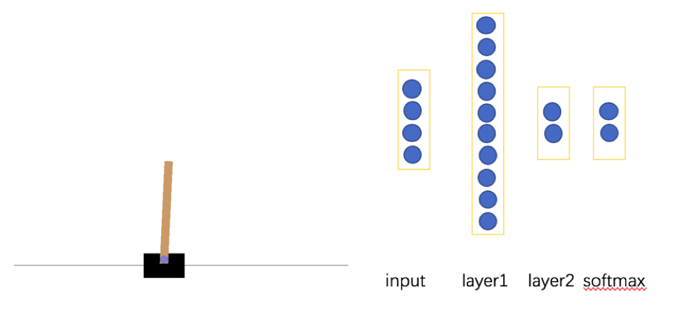

<center><h2>策略梯度方法</h2></center>

​	初识强化学习的时候，只知道有DQN，其实DQN只是强化学习的冰山一角。强化学习里面最重要的就是策略搜索的方法。

​	策略搜索是指将策略用函数来表示$\pi_{\theta}(s)​$:可以选择线性或者非线性函数表示，寻找最优的参数$\theta​$，使得累计回报最大：$$E[\sum_{t=0}^{T}R(s_{t}|\pi_\theta)]​$$。

​	我们比较一下值函数 和 策略搜索的优缺点。

1. 策略搜索是直接对策略优化，形式更简单，有更好的收敛性；
2. 值函数方法对动作空间要求很高；
3. 策略搜索直接使用随机策略，因为随机策略可以将探索直接集成到策略学习里面去；
4. 策略搜索容易陷入局部最小值；
5. 评估策略是方差较大。

现在我们推导一下策略梯度方法：

​	我们用$$\tau$$来表示一组状态-行为序列，其实可以理解为就是一个episode，$s_0,u_0,…,s_T,u_T$,符号$$R(\tau)=\sum_{t=0}^{T}(s_t,u_t)$$表示序列的回报，$P(\tau,\theta)$表示序列出现的概率，因此目标函数可以如下：

​				$$U(\theta)=E[\sum_{t=0}^{T}R(s_{t}|\pi_\theta)]=\sum_{\tau}P(\tau,\theta)R(\tau)$$

有了目标函数就好办了，这个问题就变成优化问题了，优化方法我们有很多。我们先使用下梯度方法。如下：

​				$$\nabla U(\theta)=\nabla \sum_{\tau}P(\tau,\theta)R(\tau) ​$$

​						$$ =\sum_{\tau}\nabla P(\tau,\theta)R(\tau) ​$$

​						$$ =\sum_{\tau}P(\tau,\theta) \frac{\nabla P(\tau,\theta)}{P(\tau,\theta) }R(\tau) ​$$

​						$$=\sum_{\tau}P(\tau,\theta)\nabla logP(\tau,\theta)R(\tau)​$$

​	我们做一下变换之后，最终的梯度变成了一个青期望，当然之所以要这么变换，主要是因为概率$P(\tau,\theta)$是一个乘积，去$log$之后就变成了求和，方便计算梯度。因此我们需要采样，假设使用当前策略$\pi_\theta$采样m条序列，因此策略梯度的估计可以使用如下方式计算。

​				 $$\nabla U(\theta)  \approx \hat g = \frac{1}{m}\sum_{i=1}^{m}\nabla logP(\tau,\theta)R(\tau)​$$

​	我们知道梯度是变化趋势最陡的地方，因此$\nabla logP(\tau,\theta)$ 参数表示如果沿正方向，这序列概率会增大，反之亦然。$ R(\tau)$ 控制着更新的方向和步长，解释和$\nabla logP(\tau,\theta)$一样。

​	上面的是式子最难计算的还是概率，回报只要直接累计求和就可以。因此，我们把概率展开看下。

​				$$\nabla_{\theta} logP(\tau^{i},\theta)=\nabla_{\theta}log[\prod_{t=0}^{T}P(s_{t+1}^{i}|s_{t}^{i},u_{t}^{i})*\pi_{\theta}(u_{t}^{i}|s_{t}^{i})]​$$

​					$$\sum_{t=0}^{T}  \nabla_{\theta} log \pi_{\theta}(u_{t}^{i}|s_{t}^{i})$$

​	上面的公式把联乘展开后，因为我们是对$$\theta$$求偏导，因此不含$\theta$的都去掉，最后只剩下上式。

​	上面的策略梯度是无偏的，但是方差很大，因此我们引入一个常数，在保证梯度不变的情况下，即

​		 $$\nabla U(\theta)  \approx \hat g = \frac{1}{m}\sum_{i=1}^{m}\nabla logP(\tau,\theta)R(\tau) = \frac{1}{m}\sum_{i=1}^{m}\nabla logP(\tau,\theta)(R(\tau)-b) ​$$

​	我们引入上常数$b$是为了降低方差，我们都知道方差的公式 ，因此只要求方差对参数$b$的偏导即可：

$$min\frac{\partial Var(x)}{\partial  b} $$  可以求出$b$的值。

​	从 MDP的假设我们知道，当前的动作不能够影响已经发生的回报，因此，我们再把回报累计求和去掉其中的相对于动作之前的回答，因此策略梯度如下：

​		 $$\nabla U(\theta)  \approx  \frac{1}{m}\sum_{i=1}^{m}\nabla logP(\tau,\theta)R(\tau) = \frac{1}{m}\sum_{i=1}^{m}\nabla logP(\tau,\theta)(R(\tau)-b) $$

​				$$=\frac{1}{m}\sum_{i=1}^{m} \sum_{t=0}^{T-1}\nabla logP(\tau,\theta)(\sum_{k=t}^{T-1}R(s_{k}^{i})-b)$$	

​	这一节我们主要介绍了基本的策略梯度，光看上面公式并没有什么意思，我们在这举个例子，看下实际是怎么把上面一堆公式变成代码的。

​	使用gym环境中典型的小车倒立摆系统，



```python
#学习，以便更新策略网络参数，一个episode之后学一回
    def learn(self):
        #计算一个episode的折扣回报
        discounted_ep_rs_norm = self._discount_and_norm_rewards()
        #调用训练函数更新参数
        self.sess.run(self.train_op, feed_dict={
            self.tf_obs: np.vstack(self.ep_obs),
            self.tf_acts: np.array(self.ep_as),
            self.tf_vt: discounted_ep_rs_norm,
        })
        #清空episode数据
        self.ep_obs, self.ep_as, self.ep_rs = [], [],[]
        return discounted_ep_rs_norm
    def _discount_and_norm_rewards(self):
        #折扣回报和
        discounted_ep_rs =np.zeros_like(self.ep_rs)
        running_add = 0
        for t in reversed(range(0, len(self.ep_rs))):
            running_add = running_add * self.gamma + self.ep_rs[t]
            discounted_ep_rs[t] = running_add
        #归一化
        discounted_ep_rs-= np.mean(discounted_ep_rs)
        discounted_ep_rs /= np.std(discounted_ep_rs)
        return discounted_ep_rs
```

