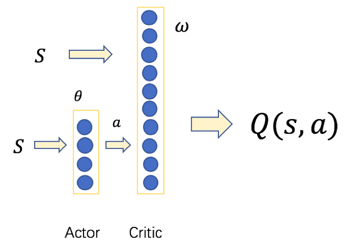
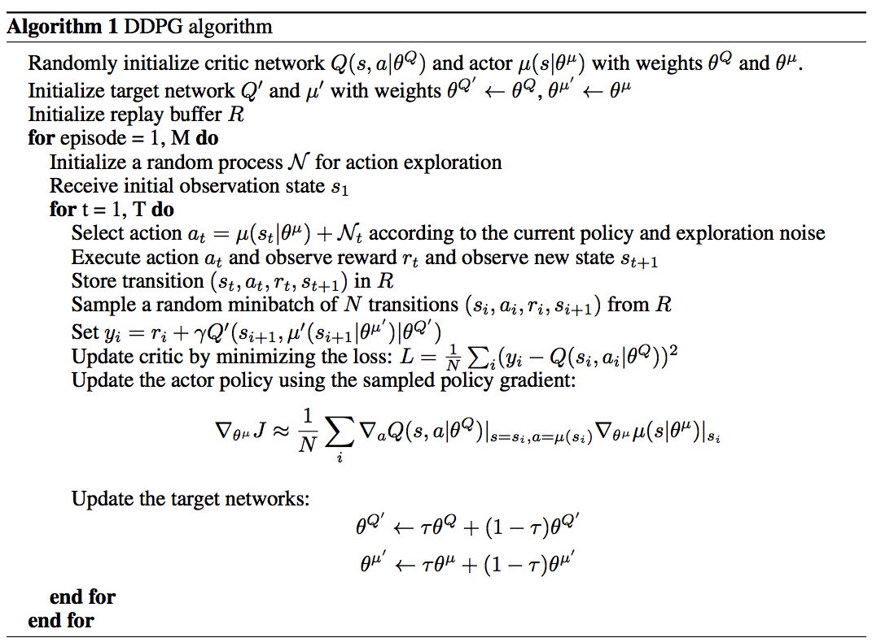

<h2>确定性策略</h2>

​	14年之前一直在发展随机策略搜索方法，因为大家一直认为确定性策略（每个状态都只有一个动作，没有探索能力）不存在。直到14年Silver在《Deterministic Policy Gradient Algorithms》中提出确定性策略理论，15年DeepMind将改理论与DQN相结合提出DDPG算法。有了前面的基础，这一节只是把策略梯度和DQN方法结合起来。

​	我们先从公式上看随机策略和确定性策略：

​	随机策略：

​			$$\pi_{\theta}(a|s)=P(a|s,\theta)$$

​	确定性策略：

​			$$a = \pi_{\theta}(s)$$			

​	为什么要讨论确定性策略，因为确定性策略数据利用率高，算法效率高。前面提到确定性方法的确定，因此不然不会只存在确定性，肯定有其非确定性。联系前面几节介绍，当然是用异策略啦（off-policy）,行动策略采用随机策略，评估策略采用确定性策略。整个确定性策略采用AC(Actor-Critic Algorithm)框架.

​	上面的图中展示了两个网络，一个Actor通过随机策略选择一个动作，Critic使用当前状态计算回报。

​	随机策略梯度：

​		$$\nabla_{\theta}J(\pi_{\theta})=E_{s \sim \rho^{\pi},a \sim \pi_{\theta}}[\nabla_{\theta}\log \pi_{\theta}(a|s)Q^{\pi}(s,a)]$$

​	异策略确定性策略梯度：

​		$$\nabla_{\theta}J(\mu_{\theta})=E_{s \sim \rho^{\mu}}[\nabla_{\theta}\log \mu_{\theta}(a|s) \nabla _{a}Q^{\pi}(s,a)]$$

​	对比两个式子，异策略确定性策略梯度少了对动作的积分，多了回报函数对动作的偏导，根据Qleaning和链式法则可以得出参更新公式，如下：

​	$$\delta_t=r_t +\gamma Q(s_{t+1}, \mu_{\theta}(s_{t+1}))-Q(s_t,a_t)$$

​	$$\omega_{t+1} = \omega_{t}  +  \alpha_{\omega}\delta_{t}\nabla_{\omega}Q(s_t,a_t)$$

​	$$\theta_{t+1} = \theta_{t} + \alpha_{\theta}\nabla_{\theta}\mu_{\theta}(s_t)\nabla_{a}Q(s_t,a_t)|_{a=\mu_{\theta}(s)}$$

以上就是DPG算法的核心了，DDPG是深度确定性策略，把DQN的一些技巧训练DDPG。

